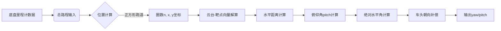
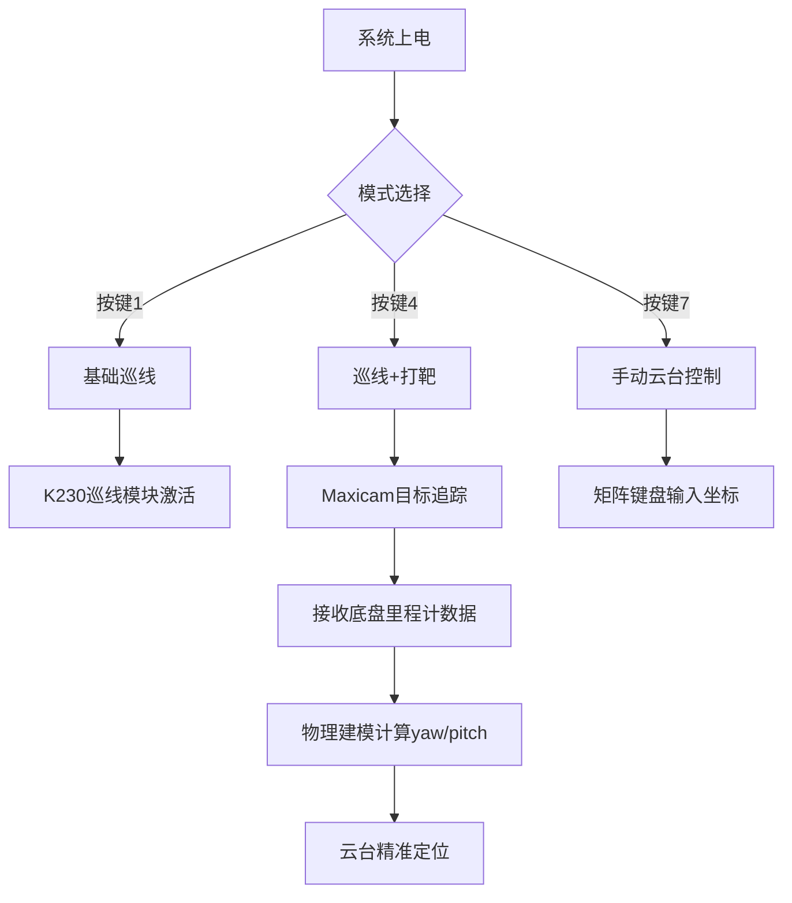

# 🎯 2025 TI杯全国大学生电子设计竞赛 E题：简易自行瞄准装置 🚀

🌟 **获奖作品**：省级一等奖 | 🕒 2025年TI杯全国大学生电子设计竞赛  
🚗 **核心系统**：智能小车 + ZDT42步进电机云台 | 🔍 **视觉模块**：Maxicam Pro AI视觉模组
🏫 **参赛单位**：**东南大学 - 生为刺猬队**  
👥 **团队成员**：周艺舵、樊一鸣、顾啸宇

## 🌟 项目概述
本项目实现了一套高度集成的智能瞄准系统，结合了：
- 🧭 **精准运动控制**（PID双电机控制）
- 🤖 **AI视觉识别**（Maxicam Pro目标检测）
- 🎯 **实时动态瞄准**（三维空间坐标转换）
- 📊 **多模态交互系统**（OLED+矩阵键盘）

系统在复杂环境下表现出优异的稳定性和精确性，成功解决了"移动平台上的实时瞄准"这一核心挑战。

---

## 🧩 系统架构
```
+-----------------+     +----------------+     +---------------+
|  视觉处理模块     |<--->| 主控制器(MSPM0) |<--->| 云台控制系统    |
| (Maxicam Pro)   |     |                |     | (ZDT42步进)   |
+-----------------+     +-------+--------+     +---------------+
            ↑                   |                    ↑
            |                   |                    |
            |                   ↓                    |
      +------------+     +---------------+     +---------------+
      | 巡线模块    |     | 电机控制系统    |     |   激光发射装置  |
      |  K230      |     | (PID+编码器)   |     |               |
      +------------+     +---------------+     +---------------+
```

---

## 💡 核心创新点

### 1. 动态PID调整系统 🔄
```c
void adj_perf4_pid() {
  KP_p4 = InputFloat(8, 2, 0); 
  KD_p4 = InputFloat(8, 2, 0);
}
```

### 2. 三维空间坐标映射 🗺️
```c
void calculate_angles_for_perf4(float x, float y, float height, int car_direction, 
                       float target_x, float target_y, float target_height,
                       float *yaw, float *pitch) {
  // 空间几何解算核心算法
}
```

### 3. 复合任务处理器 ⚙️
```c
void Perform4() {
  while(car_stage != 's'){
    go_on_line(0.25);      // 巡线控制
    update_motor_speed();  // 电机更新
    if(perf_4_flag) {      // 打靶条件检测
      calculate_target();  // 目标解算
    }
  }
}
```

---

## 🧠 智能核心模块

### 1. 运动控制系统 (`motor.c`)
```c
// 自适应巡线算法
int go_on_line(float speed_m_per_s) {
  float current_error = line_error; // 视觉误差输入
  float p_term = KP * current_error; 
  float d_term = KD * (current_error - last_error);
  // ...智能速度分配算法...
}

// 精确转向控制
void turn_pid(float base_speed, float target_angle, float threshold, float Kp) {
  while (fabsf(calculate_yaw_error(target_angle, yaw)) >= threshold) {
    // 实时调整转向参数
  }
}
```

### 2. 云台瞄准系统 (`PTZ_controller.c`)
```c
// 世界坐标系转换
void calculate_angles(float x, float y, float* theta_x, float* theta_y) {
  *theta_x = atan2f(x, dist_to_canvas) * (180.0f / M_PI);
  float effective_dist = sqrtf(x*x + dist_to_canvas*dist_to_canvas);
  *theta_y = atan2f(y - pen_height, effective_dist) * (180.0f / M_PI);
}

// 交互式云台控制
void contrl_ptz() {
  int x = (int)InputFloat(5, 0, 0); // X轴角度
  int y = (int)InputFloat(5, 0, 0); // Y轴角度
  set_xy_offsets(x,y); // 设置云台位置
}
```

### 3. 视觉通信系统 (`uart_handler.c`)
```c
// 鲁棒性通信协议
void extract_template(uint8_t *data, uint8_t size) {
  if(data[0]=='<' && data[7]=='>') { // 帧校验
    // 数据提取与转换
    convert_to_float(nums); // 视觉误差值转换
  }
}

// DMA双缓冲传输
void uart_init(void) {
  DL_UART_Main_enableDMAReceiveEvent(UART_K230_INST, DL_UART_DMA_INTERRUPT_RX);
  // ...双缓冲配置...
}
```

### 4. 多任务调度系统 (`main.c`)
```c
while(1) {
  char key = KEY_SCAN(); // 矩阵键扫描
  switch (key) {
    case 1: Perform1(); break; // 基础巡线
    case 4: Perform4(); break; // 巡线+打靶
    case 7: contrl_ptz(); break; // 手动云台
    case 11: adj_line_pid(); break; // PID调整
  }
}
```

---

## 🔭 Maxicam Pro视觉模块 (multy_edge.py)

### 🎯 核心功能

#### 1. 矩形目标检测与透视变换
```python
def process_quadrilateral_detection(img, serial, frame_counter):
  # 图像预处理：畸变校正、ROI区域处理
  # 边缘检测与轮廓查找
  # 计算透视变换矩阵
  # 返回矩形角点坐标和中心位置
```

#### 2. 激光点检测
```python
def detect_laser_point(img):
  # LAB颜色空间转换
  # 双阈值检测（内圈和外圈）
  # 形态学增强处理
  # 返回激光点中心坐标
```

#### 3. 云台控制指令生成
```python
def set_xy_angles(uart, x_angle, y_angle):
  # 自适应速度控制（大角度变化用高速，小角度微调用低速）
  # 生成步进电机控制帧（29字节完整帧）
  # 通过串口发送指令并更新当前角度
```

#### 4. 物理建模与角度解算（核心创新）
```python
def calculate_angles_for_perf4(total_distance):
  """
  📐 基于底盘里程计数据的物理建模计算
  
  参数:
    total_distance: 底盘累计行驶距离(cm)
  
  返回:
    yaw: 云台水平转角(0-720+度)
    pitch: 云台俯仰角(度)
  """
  
  # 1. 根据总路程计算车辆位置
  n, x, y = get_position_from_distance(total_distance)
  
  # 2. 坐标系转换模型
  # 世界坐标系 → 车辆坐标系 → 云台坐标系
  dx = target_x - x
  dy = target_y - y
  dz = target_height - height
  
  # 3. 水平距离计算（忽略高度）
  horizontal_distance = math.sqrt(dx**2 + dy**2)
  
  # 4. 俯仰角计算
  pitch = math.degrees(math.atan2(dz, horizontal_distance))
  
  # 5. 绝对水平角度计算
  absolute_yaw = 90 - math.degrees(math.atan2(dy, dx))
  
  # 6. 车头朝向补偿
  # 根据车辆所在跑道位置确定车头方向
  if on_side1: car_heading = -180  # 车头向下
  elif on_side2: car_heading = -270 # 车头向右
  # ...
  
  # 7. 相对角度计算
  relative_yaw = absolute_yaw - car_heading
  return relative_yaw, pitch
```

### 🔄 里程计数据融合流程


---

## 🚗 K230巡线模块 (weapon_car.py)

### 🔍 核心功能

#### 1. 多区域巡线检测
```python
def find_blobs_in_rois(img):
  # 划分5个垂直ROI区域
  # 色块过滤（面积800-15000像素）
  # 区域权重分配（下方区域权重更高）
```

#### 2. 右转优先决策
```python
def detect_road_choose_right(roi_blobs_result, img):
  # 选择每个区域最右侧的色块
  # 加权平均计算转向偏差
  # 输出格式化控制指令：<±XX.XX>
```

#### 3. 特殊场景识别
```python
def detect_left_turn(roi_blobs_result):
  # 条件1：ROI1无有效色块
  # 条件2：ROI2/ROI3出现大面积色块
  # 触发左转标志：<+99.99>
```

---

## 🛠️ 硬件配置
| 模块         | 型号/规格                     | 功能特点                     |
|--------------|-------------------------------|-----------------------------|
| 主控制器     | TI MSPM0G3507                 | 80MHz Cortex-M0+核心       |
| 驱动电机     | MG520X直流减速电机         | 6V/300RPM，集成光电编码器   |
| 云台电机     | ZDT42步进电机                 | 1.8°步进角，高精度闭环控制  |
| 视觉模块     | Maxicam Pro AI视觉模组        | 支持YOLOv5目标检测          |
| 巡线模块     | K230视觉处理器                | 5区域ROI检测，640×480输入   |
| 姿态传感器  | LSM6DSV16X 6轴IMU             | ±2000dps，低噪声            |
| 显示模块     | SSD1306 0.96寸OLED            | 128×64分辨率，I²C接口       |
| 输入设备     | 4×4矩阵键盘                   | 16键多功能控制              |

---

## 💻 开发环境
1. **编译环境**：  
   TI Code Composer Studio  
   - 集成编译+调试+烧录一体化环境
   - 完整MSPM0芯片支持包
   - 实时变量监控与分析工具

2. **烧录工具**：  
   TI XDS110 Debug Probe  
   - 通过USB直接烧录和调试
   - 支持实时变量监控
   - 4线JTAG接口

3. **依赖库**：
   ```bash
   DriverLib - MSPM0外设驱动库
   grlib - 图形显示库
   math.h - 数学运算库
   OpenCV - 计算机视觉库
   ```

---

## 📋 使用指南



---
## 📜 版权声明
© 2025 生为刺猬队（东南大学） - 保留所有权利  
**代码授权**：MIT License  
**TI驱动库版权**：归Texas Instruments Incorporated所有
